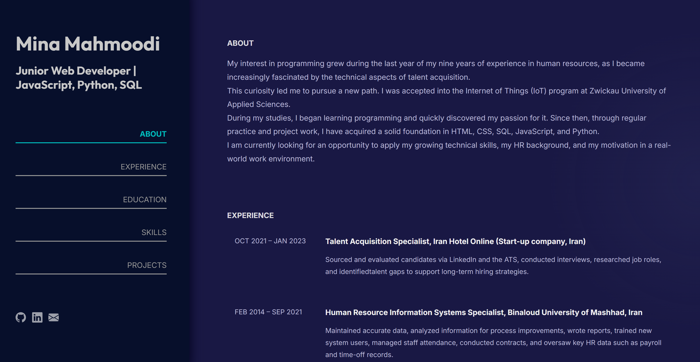
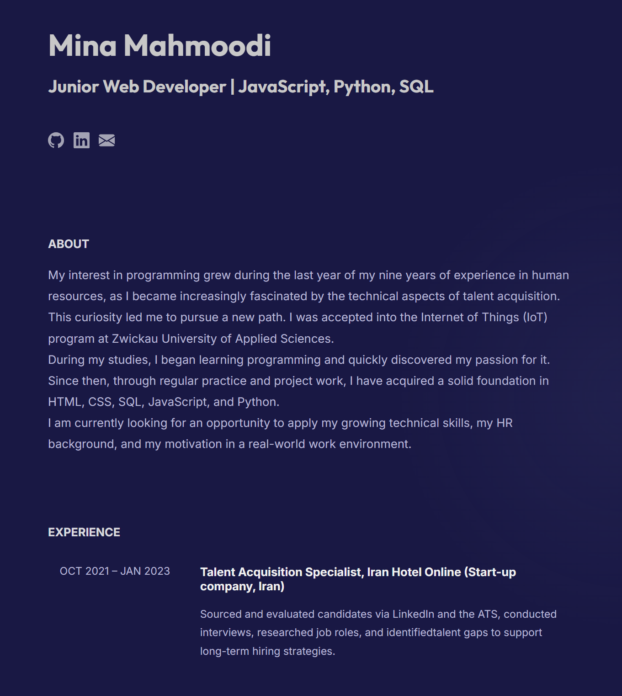

# Personal Portfolio – Mina Mahmoodi
## Description
A responsive, single-page portfolio website built with HTML, CSS, and vanilla JavaScript to showcase professional experience, education, projects, and skills. 

## Features
- **Single-page portfolio layout**
- **Dynamic content rendering**
- **Scroll spy navigation**
- **Mouse-following glow effect**
- **Responsive layout styles**
<table>
  <tr>
    <td></td>
    <td></td>
  </tr>
</table>


## Installation Options:
#### Option1:
- Install Live Server extension on VS code
- Click Go Live button on the right bottom of VS code

#### Option2 (recommended):
- Install Node.js on your computer
- Open the terminal in VS code
- To check if the Node.js has been successfully installed, execute this command: 
```bash
node -v
```
You should see some kind of number here like v22.21.1
- Afterwards, install the Live Server globally using:
```bash
npm install live-server -g
```
If you are on Mac, use:
```bash
sudo npm install live-server -g
```
- Finally, type this
```bash
live-server
```
⚠️ **Important:** To avoid CORS/module loading issues with ES modules, it’s recommended to serve the files via a local web server instead of opening the HTML files directly from the filesystem.
